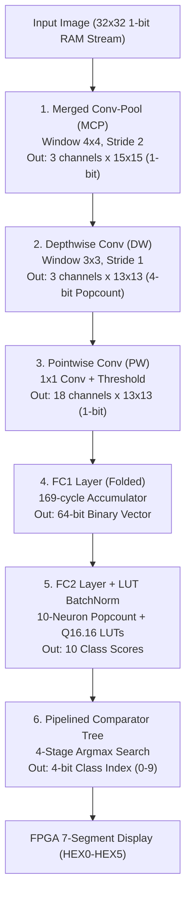

# BNN-QuickDraw-FPGA: Binarized Depthwise Separable CNN Accelerator

Hardware accelerator implemented in SystemVerilog for real-time handwritten doodle classification based on Google's **"Quick, Draw!"** dataset, deployed on **Altera/Intel Cyclone IV FPGA**.

---

## 📌 Executive Summary

This project implements a **Binarized Depthwise Separable Convolutional Neural Network (BDSCNN)** hardware accelerator optimized for low-resource FPGA deployment. By binarizing weights and activations to $\{-1, +1\}$ (represented as `0` and `1` logic bits), expensive floating-point arithmetic is completely replaced with lightweight bitwise operations (`AND`, `XNOR`) and population counters (`Popcount`).

### Key Performance & Architectural Highlights
* **Zero DSP / Floating-Point Multipliers:** All linear convolutions and dense layer calculations are computed using pure logic gates.
* **Hardware Folding (Time-Multiplexing):** The first Fully Connected (FC1) layer serializes $18 \text{ channels} \times 169 \text{ spatial pixels} = 3042$ inputs over 169 clock cycles, reducing hardware logic resource utilization drastically.
* **LUT-based Batch Normalization:** Floating-point Batch Normalization equations in the output layer (FC2) are pre-computed into 65-entry Look-Up Tables (LUTs) with Q16.16 fixed-point precision, eliminating hardware division and square-root logic.
* **Pipelined Argmax Comparator Tree:** A 4-stage binary comparison tree evaluates class scores within 4 clock cycles for high operational frequency ($F_{max}$).
* **Python-to-RTL Co-Verification:** Includes a PyTorch Quantization-Aware Training (QAT) model and Python simulation scripts to generate golden vectors and verify RTL behavior.

---

## 📐 System Architecture & Pipeline

The accelerator processes $32 \times 32$ binary input images (1-bit per pixel) streamed from on-chip RAM and produces a 4-bit class index (0–9) displayed on 7-segment LEDs.



---

## 🔬 Layer-by-Layer Hardware Breakdown

| Layer | Type | Input Size | Output Size | Kernel / Operation | Hardware Optimization |
| :--- | :--- | :--- | :--- | :--- | :--- |
| **MCP** | Merged Conv-Pool | $32 \times 32 \times 1$ | $15 \times 15 \times 3$ | $4 \times 4$, Stride 2 | Combines Convolution and Pooling into a single windowing step. |
| **DW** | Depthwise Conv | $15 \times 15 \times 3$ | $13 \times 13 \times 3$ | $3 \times 3$, Stride 1 | Outputs 4-bit Popcount (0–9) directly to retain precision without premature activation. |
| **PW** | Pointwise Conv | $13 \times 13 \times 3$ | $13 \times 13 \times 18$ | $1 \times 1$ Conv + Sign | Multiplies 4-bit DW integer outputs with binary PW weights and applies thresholding. |
| **FC1** | Fully Connected 1 | $13 \times 13 \times 18$ ($3042$ inputs) | $64$ neurons (64-bit) | Dense matrix-vector product | **Hardware Folding:** Processes 18-bit (1 spatial pixel) per clock over 169 cycles. |
| **FC2** | Fully Connected 2 | $64$ inputs | $10$ class scores | Dense + BatchNorm | **LUT Mapping:** Uses 65-entry Q16.16 LUTs for BatchNorm, followed by 4-stage Argmax Tree. |

---

## 📂 Project Structure

```
BNN-QUICKDRAW-FPGA-master/
├── weight_rom/               # Raw weight & threshold text files from PyTorch QAT
│   ├── dw_weights.txt
│   ├── pw_weights.txt / pw_thresh.txt
│   ├── fc1_weights.txt / fc1_thresh.txt
│   ├── fc2_weights.txt / fc2_bn_*.txt
│   └── mcp_weights.txt / mcp_thresh.txt
│
└── RTL/                      # Hardware Design, Testbenches, and Verification
    ├── compile.f             # SystemVerilog compilation file list
    ├── rtl/                  # Synthesizable SystemVerilog Design Files
    │   ├── bdscnn_quickdraw.sv   # FPGA Top-level wrapper (ISSP trigger, RAM, 7-Segment LED)
    │   ├── bdscnn_top.sv         # Core BNN Pipeline Top Module
    │   ├── mcp_top.sv / mcp_pe.sv # Merged Conv-Pool layer & Processing Element
    │   ├── dw_top.sv / dw_pe.sv   # Depthwise layer & Processing Element
    │   ├── pw_top.sv / pw_pe.sv   # Pointwise layer & Processing Element
    │   ├── fc1_folded_top.sv      # Folded FC1 top module
    │   ├── fc1_folded_neuron.sv   # Folded FC1 neuron with 169-cycle accumulator
    │   ├── fc2_top.sv             # FC2 layer with BatchNorm LUTs & Pipelined Comparator Tree
    │   ├── popcount.sv            # Parameterized Population Counter
    │   ├── window4x4s2.sv         # Line buffer sliding window (4x4, stride 2)
    │   └── window3x3s1.sv         # Line buffer sliding window (3x3, stride 1)
    │
    ├── tb/                   # SystemVerilog Testbenches & Parameter Generators
    │   ├── tb_bdscnn_top.sv       # Full system testbench
    │   ├── fc2_luts.py            # Python script to generate Q16.16 BatchNorm LUTs
    │   ├── fc1_constant_gen.py    # Python script to generate fc1_constants.sv
    │   └── create_param.py        # Python script to convert weights into SV parameters
    │
    ├── fpga_test_vectors/    # Verification & PyTorch Model Files
    │   ├── best_qat_quickdraw_model.pth # Quantization-Aware Trained PyTorch model
    │   ├── golden.py             # PyTorch golden inference script for RTL checking
    │   ├── terminal_draw.py      # Terminal-based drawing UI for custom test input
    │   └── test_img_*.txt        # Binary test image vectors
    │
    └── sim/                  # ModelSim Simulation Workspace
```

---

## 🛠️ Verification & Building

### 1. Generating SystemVerilog Parameters from Weights
To regenerate the SystemVerilog constant packages and LUT arrays from raw PyTorch trained weights:
```bash
cd RTL/tb
python fc2_luts.py          # Generates FC2 BatchNorm LUT text files
python fc1_constant_gen.py # Generates fc1_constants.sv
python create_param.py     # Generates SystemVerilog parameter files
```

### 2. Running Verification in ModelSim
1. Open ModelSim and set the working directory to `RTL/sim`.
2. Compile all files listed in `RTL/compile.f`:
   ```tcl
   vlib work
   vlog -f ../compile.f
   ```
3. Run the top-level testbench:
   ```tcl
   vsim work.tb_bdscnn_top
   run -all
   ```

### 3. FPGA Synthesis (Intel Quartus Prime)
1. Open Quartus Prime and load `bdscnn_quickdraw.qpf` located in `RTL/rtl/`.
2. Target Device: **Altera Cyclone IV E (10M50DA154C7G / DE10-Lite)**.
3. Run **Full Compilation**.
4. Program the board using **Quartus Programmer**.

---

## 🏆 Key Achievements & Technical Value
* Designed a complete end-to-end hardware acceleration pipeline from Deep Learning (PyTorch QAT) to FPGA RTL implementation.
* Demonstrated advanced hardware design patterns: **Hardware Folding (Time-Multiplexing)** and **ROM/LUT-based Non-linear Function Evaluation**.
* Solved resource constraint challenges on low-end FPGAs while achieving real-time inference throughput.
